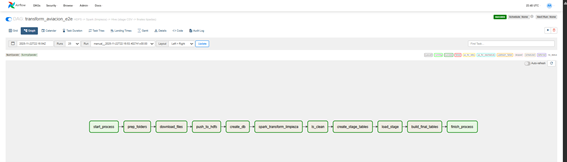
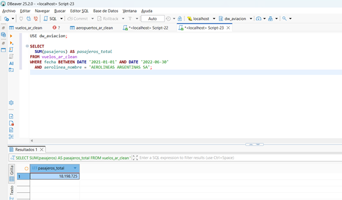
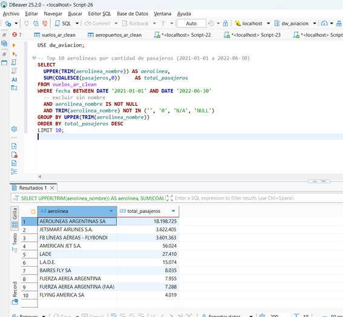

# Ejercicio 1 – Pipeline de Aviación (Airflow + Spark + Hive)

Este ejercicio implementa un pipeline ETL completo para procesar datos de aviación argentina usando:

- **Apache Airflow** para orquestación
- **PySpark** para transformaciones distribuidas
- **Apache Hive** como data warehouse
- **HDFS** como sistema de archivos distribuido

---

## 📂 Estructura del ejercicio

ejercicio-1/
│── airflow/ # DAG de Airflow
│── hive/ # DDL y queries de análisis
│── scripts/ # Scripts de ingest y transformación
│── images/ # Imágenes de DAG y consultas
│── README.md # Este archivo

---

## 🚀 1. DAG de Airflow

El DAG principal se encuentra en:
airflow/transform_aviacion_e2e.py

Este DAG realiza:

1. Descarga de datasets desde S3  
2. Ingesta a HDFS  
3. Creación de tablas Hive  
4. Limpieza y transformaciones  
5. Inserción de tablas finales

### 📸 Imagen del DAG

  

---

## 🛠️ 2. Scripts utilizados

### Ingesta (bash)

scripts/ingest_aviacion.sh

### Transformación con PySpark

scripts/transformacion_aviacion.py

---

## 🗄️ 3. Tablas Hive

Se encuentran en:
hive/create_tables.sql

Incluye la creación del Data Warehouse y tablas staging/finales.

---

## 📊 4. Consultas de análisis (KPIs)

Disponibles en:

hive/queries_aviacion.sql

### 📊 Resultados de las Queries

  

  

  

  

---

## 📝 Notas

- Todas las rutas están parametrizadas en Variables de Airflow.
- Los CSV usan separador `;`.
- Se aplican transformaciones: casteos, limpieza, normalización y uniones.

---

## ✔️ Estado

Pipeline funcional y validado con todas las consultas requeridas.

