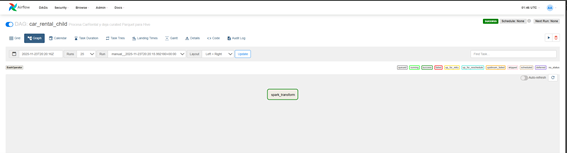
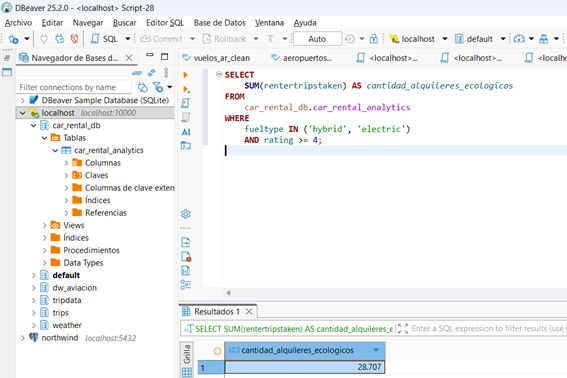
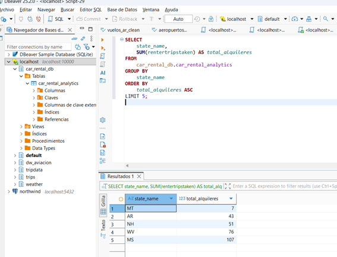
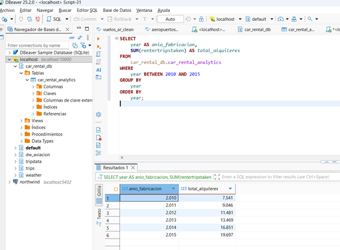
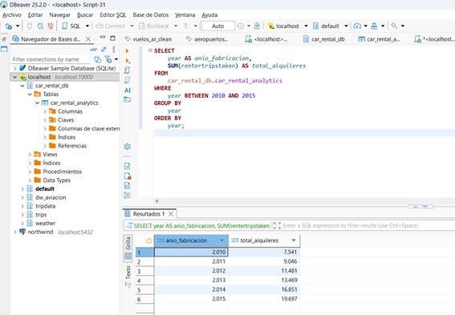
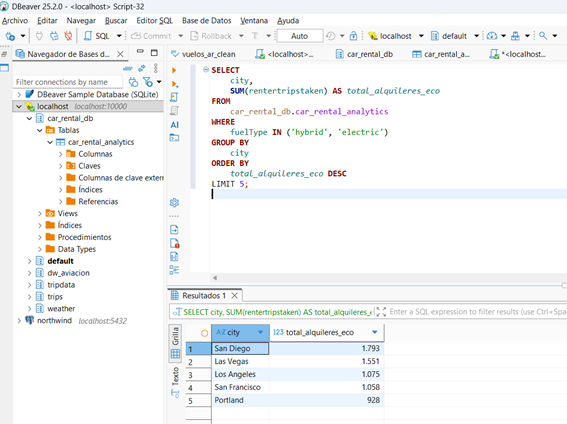
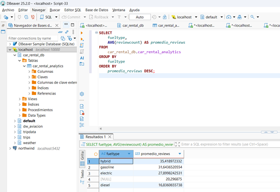

🚗 Ejercicio 2 – Pipeline Car Rental (Airflow + Spark + Hive)
Este ejercicio implementa un pipeline ETL completo para procesar datos de alquileres de autos usando:

Apache Airflow para orquestación

PySpark para transformaciones distribuidas

Apache Hive como data warehouse

HDFS como sistema de archivos distribuido

📂 Estructura del ejercicio
ejercicio-2/ contiene:

airflow/ → DAG Padre y DAG Hijo

hive/ → Tabla externa y DDL

scripts/ → Ingesta + transformación PySpark

images/ → Imágenes del DAG y consultas

README.md → Este archivo

🚀 1. DAGs de Airflow
🔷 DAG Padre: car_rental_parent.py
Realiza:

Descarga datasets desde S3

Copia a landing

Ingesta a HDFS

Trigger del DAG hijo

📸 Imagen del DAG Padre

🔶 DAG Hijo: car_rental_child.py
Realiza:

Transformación completa con PySpark

Escritura de datos curated en Parquet

Preparación final para Hive

📸 Imagen del DAG Hijo

🛠️ 2. Scripts utilizados
📌 Ingesta (bash)
scripts/ingest_car_rental.sh

Funciones:

Descarga datasets desde S3

Limpieza de landing

Creación de carpetas

Envío a HDFS (/car_rental/raw)

Listado final

📌 Transformación en PySpark
scripts/transformation_car_rental.py

Incluye:

Limpieza de columnas

Conversión de tipos

Normalización (trim, lower)

Join con tabla de estados

Remoción de datos erróneos (ej: Texas)

Escritura en Parquet (/car_rental/curated/analytics/

🗃️ 3. Tabla Hive
Archivo: hive/create_table.sql

Crea la tabla externa final:
car_rental_analytics
📸 Evidencia de creación:

📊 4. Consultas de análisis (KPIs)
Archivo SQL: hive/queries_car_rental.sql

📸 Resultados de consultas:

📝 Notas
La ingesta usa descargables del repositorio público (S3).

Los datos RAW se guardan en /car_rental/raw.

PySpark genera Parquet limpio preparado para análisis.

Hive consulta directamente el curated layer.

